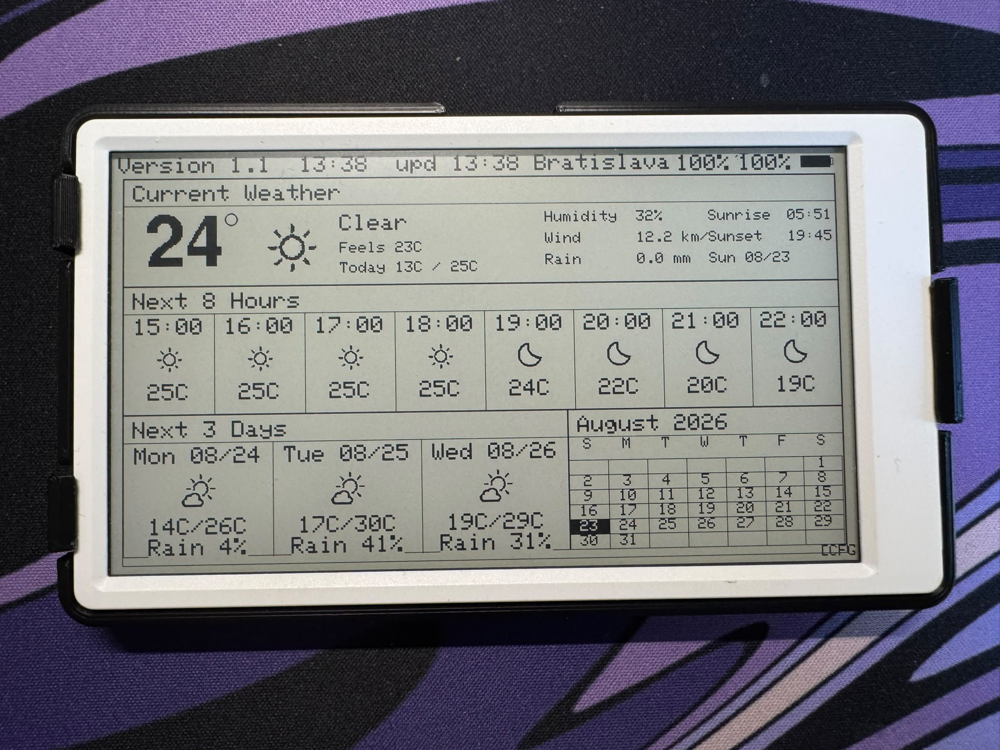
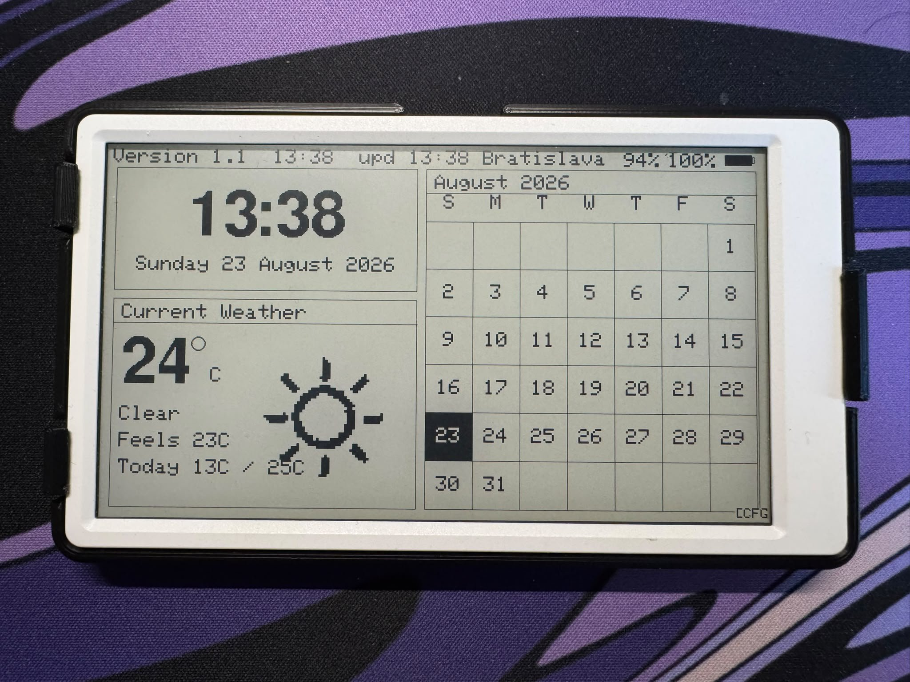

# PaperWeather-Calendar

Weather and calendar dashboard for the classic **M5Paper v1.1** (ESP32, 4.7" e-ink, 960×540). This build targets the original M5Paper kit, not the M5PaperS3.

The UI is English only. There is no on-screen language toggle.

[](https://www.arduino.cc/)
[](https://platformio.org/)
[](https://docs.m5stack.com/en/core/m5paper)

## What it does

The device shows weather from [Open-Meteo](https://open-meteo.com/) (no API key) and a calendar panel in one of two layouts. Settings are stored in flash and survive reboot.

### Face 0 — weather dashboard



Current conditions, an 8-hour chart, a 3-day forecast, and the calendar panel. After each update the device disconnects WiFi and enters deep sleep until the next scheduled refresh.

### Face 1 — clock face



Large time and date, a compact weather summary, and a larger calendar panel. It stays powered on while selected. The clock redraws on its own interval without WiFi. Weather data is fetched separately over WiFi when due.

Both faces share the same calendar mode setting (month grid or Google Calendar events).

## Hardware

| Device | Supported |
|--------|-----------|
| M5Paper v1.1 (SKU K049-B) | Yes |
| M5PaperS3 and other M5 boards | No |

You need 2.4 GHz WiFi. The ESP32 does not support 5 GHz.

Libraries: **M5Unified**, **M5GFX**, **M5Unit-ENV** (onboard SHT30). Do not use the old M5EPD library.

Product page: [M5Paper v1.1](https://shop.m5stack.com/products/m5paper-esp32-development-kit-v1-1-960x540-4-7-eink-display-235-ppi)

When the onboard SHT30 responds, local temperature and humidity are shown. If the sensor is unavailable, the display falls back to values from the weather API.

## Build and flash

```bash
git clone <this-repo>
cd m5paperWeather-Calendar
pio run -e Paper
pio run -e Paper --target upload
pio device monitor --baud 115200
```

`platformio.ini` uses `board = m5stack-fire` with `-DARDUINO_M5STACK_Paper` because `m5stack-paper` is missing from many PlatformIO installs. Flash is 16 MB with PSRAM enabled. If your PlatformIO install includes `m5stack-paper`, you can switch the board name.

## Configuration

Settings can be changed in two places:

1. **On-device quick settings** — tap **[CFG]** in the bottom-right corner after a manual reset (see Controls below). Covers WiFi, location, calendar mode, refresh schedules, and night mode. Changes apply after **Save & Restart**.
2. **Web setup portal** — connect to the device access point and open the setup page in a browser. Required for the Google Calendar ICS URL and opened automatically when WiFi credentials are missing or Google Calendar mode is selected without a URL.

On the WiFi page of the on-device UI, **Web setup** starts the same portal without erasing other settings.

### Web portal (first boot or ICS URL)

1. Connect to WiFi network **`PaperWeather-Calendar`**, password **`configure`**.
2. Open `http://192.168.4.1`.
3. Set WiFi, location, temperature unit, refresh intervals, night mode, and calendar options.
4. For Google Calendar mode, paste the ICS URL.
5. Click **Save & Restart**.

The portal also opens on its own when the device has no saved WiFi or when Google Calendar is enabled but no ICS URL is stored.

### On-device settings pages

After reset, tap **[CFG]** within 30 seconds. Pages:

| Page | Contents |
|------|----------|
| WiFi | Saved network, scan and connect wizard, link to web setup |
| Location | City, optional coordinates, °F/°C |
| Calendar | Month vs Google mode; ICS status (URL must be set via web) |
| Schedule | Refresh intervals for both faces (see below) |
| Night | Night mode on/off, start and end hour |

**Back** or rotary **up** (`BtnA`) exits without saving. **Save & Restart** writes preferences and reboots.

On-device save does not overwrite an existing ICS URL. Set or change the URL through the web portal.

## Controls

After a **manual reset or power-on**, the device stays awake for 30 seconds:

- Tap **[CFG]** (bottom-right) to open settings.
- Rotate the side wheel **up** or **down** (`BtnA` / `BtnC`, GPIO37 / GPIO39) to switch between Face 0 and Face 1. The choice is saved.

While settings or the web portal are open, `BtnA` is **Back** only; it does not change faces.

Timer wakes (scheduled refresh) skip the 30-second window: the device fetches data if needed, draws the saved face, and continues its sleep or clock loop.

## Refresh schedules

Night mode, when enabled, switches each face to its night interval during the configured hours (default 22:00–05:00). When night mode is off, day intervals are always used.

Allowed values are fixed steps, not arbitrary minutes.

### Face 0 (weather dashboard)

| Setting | Options (min) | Default day | Default night |
|---------|---------------|-------------|---------------|
| Weather refresh | 1, 5, 10, 15, 30, 60, 120, 240, 480 | 10 | 480 |

Between refreshes the device sleeps with WiFi off.

### Face 1 (clock face)

Face 1 uses two independent timers:

| Setting | Options (min) | Default day | Default night |
|---------|---------------|-------------|---------------|
| Clock display | 1, 5, 10, 15, 30, 60, 120, 240 | 1 | 15 |
| Weather fetch | 15, 30, 60, 120, 240, 480 | 30 | 240 |

The clock interval controls how often the time and date are redrawn on the e-ink panel. A longer interval at night reduces updates when the display is unlikely to be viewed. Weather fetch turns WiFi on only for its own interval.

While Face 1 is active the device does not enter deep sleep. Switching back to Face 0 returns to the sleep cycle above.

## Calendar panel

**Month Calendar** (default): Sunday-start grid for the current month. Days outside the month are blank. Today is a black cell with a white numeral. No ICS URL required.

**Google Calendar**: up to three of today's events from an ICS feed. Requires a valid ICS URL in the web portal.

### Google Calendar ICS URL

1. Google Calendar → calendar settings → **Integrate calendar**.
2. Copy **Secret address in iCal format** or the public iCal address.
3. In the web setup portal, choose **Google Calendar** and paste the URL. Valid URLs usually contain `/calendar/ical/` and end with `/basic.ics`.

An HTTP 404 from the feed usually means the URL is wrong or not reachable from the device.

## Power and sleep

- Face 0 uses `M5.Power.timerSleep()` (RTC alarm, then power off).
- Face 1 keeps the CPU running and polls buttons during the post-reset window only.
- On battery, RTC wake and full power-off behave as intended. Over USB the board may not shut down completely; that is a limitation of the M5Paper power path.
- Test overnight behaviour on battery if you rely on long night intervals.

## Attribution

Based on [Bastelschlumpf's M5PaperWeather](https://github.com/Bastelschlumpf/M5PaperWeather), adapted for M5Paper S3 elsewhere, and ported here to classic M5Paper v1.1 with M5Unified/M5GFX.

## License

MIT License — see `LICENSE`.

## Acknowledgments

- [Bastelschlumpf](https://github.com/Bastelschlumpf) — original M5PaperWeather
- [Open-Meteo](https://open-meteo.com/) — weather data
- [M5Stack](https://m5stack.com/) — hardware and libraries
